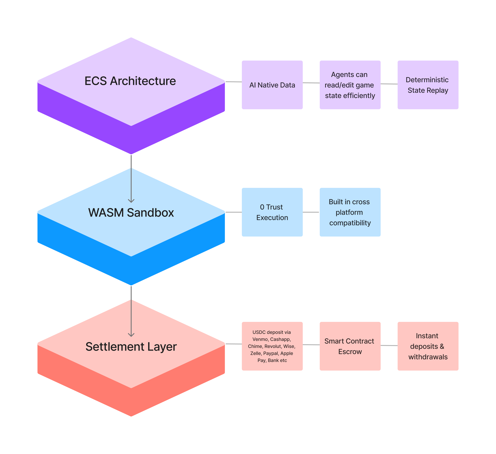

# Overtake Games
**The AI-powered platform for 1v1 skill-based mobile gaming.**

---

## 📋 Executive Summary
Gen Z has financialized every hobby (sneakers, cards, clipping), yet despite **86% of Gen Z being gamers** they cannot monetize their skill. The only options are becoming a top 0.1% pro or playing luck-based casino games where the house always wins.

**Overtake** is the "middle class" economy for gaming. We provide the infrastructure for players to compete in 1v1 skill-based games for real money.
* **We Own the Stack:** Purpose built tooling for real money arcade games.
* **AI Game Gen:** Future roadmap includes an AI engine enabling users to prompt-generate games and earn royalties.
* **Crypto Rails:** We use stablecoins & smart contract escrows to bypass the 180-day rolling reserves and high fees of traditional gaming payment processors.

---

## 🎥 Demo

---

## 🏗️ Technical Architecture
Unlike competitors who rely on clunky SDKs plugged into Unity, **we built our own platform from the ground up.**

### **The Stack**
* **Game Engine:** [Bevy](https://bevyengine.org/) (Rust-based)
    * *Why Bevy?*
        * Native **WASM sandboxing**, meaning user/AI provided games can run safely without any worry of security issues.
        * Bevy's **ECS Architecture** provides a programming model that's easy for agents to understand, and paves the way for flexible and powerful building blocks to be built and iterated on rapidly.
        * Allows us to build **Deterministic State Replay**, meaning we can re-run any match on the server to mathematically prove the winner and prevent cheating without invasive client-side anti-cheat.
* **Frontend:** Mobile Native (iOS/Android) via Bevy UI.
* **Auth:** [Privy](https://www.privy.io/)
* **Backend:** Cloudflare Workers
* **Settlement Layer:** Smart Contract Escrows (Stablecoins).
    * *Trustless Wagering:* Funds are held in escrow during the match.
    * *Instant Settlement:* Winners are paid immediately.

### **Architecture Diagram** (High Level)

---

## 👥 The Team
Our team has deep experience in crypto, game engine development, and viral consumer growth.

* **[Anish Lathker](https://www.linkedin.com/in/anish-lathker/) (CEO):** 2x Founder (Esports Startup Exit). Raised ~$500k for previous Prediction Market venture. ex Ripple, Director of Blockchain at UCI.
* **[Kainoa Kanter](https://github.com/ThatOneCalculator) (CTO):** Scaled decentralized social platform to 30k users. Open Source Contributor to Coinbase, Microsoft, Ledger, SAFE, VSCode, Bun etc.
* **[Drew Ridley](https://github.com/DrewRidley) (Founding Engineer):** Core Bevy Engine contributor. Built agentic AI cyber pipelines for 100k+ devices at Liberty Mutual.

---

## 🔒 Proprietary IP Notice
**Why is this repo empty of code?**

To protect our IP and maintain competitive integrity ahead of our public launch, our core codebase is currently hosted in a private repository.

**For ETHDenver Judges:**
We are happy to provide **read-access** to our private codebase for judging purposes.
* **Contact:** [anish@overtakegames.com](mailto:anish@overtakegames.com)
* **Twitter:** [@NullPenguin](https://twitter.com/NullPenguin)
* **Telegram:** [@NullPeng](https://t.me/nullpeng)
